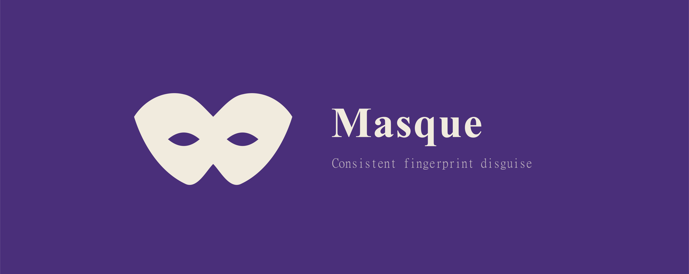

# Masque

브라우저 지문(fingerprint) 표면을 일관된 환경으로 위장하는 Chrome(Manifest V3) 확장입니다. JavaScript API와 HTTP 헤더 전반에 걸쳐 하나의 가짜 정체성을 일관되게 제시하여, 지문 수집기가 JS에서 읽는 값과 브라우저가 실제로 보내는 헤더가 서로 맞물리도록 만듭니다.

영문 문서: [README.md](README.md)


## 위장하는 항목

정체성 표면 (JavaScript):
- navigator.userAgent, appVersion, platform, vendor
- navigator.userAgentData 및 getHighEntropyValues
- navigator.language, navigator.languages
- navigator.hardwareConcurrency, deviceMemory
- navigator.maxTouchPoints, navigator.webdriver
- navigator.plugins / mimeTypes (정규 세트로 정규화)
- navigator.mediaDevices.enumerateDevices (장치 개수·라벨 정규화)
- navigator.connection (effectiveType / rtt / downlink)
- navigator.storage.estimate (quota)
- navigator.keyboard.getLayoutMap (US 레이아웃)
- navigator.gpu 어댑터 vendor (WebGPU)
- navigator.getBattery (충전 중·완충으로 정규화)
- speechSynthesis.getVoices (음성 목록 정규화)
- WebGL getSupportedExtensions / getShaderPrecisionFormat (페르소나 GPU 계열에 맞춰 정규화)
- screen 크기, devicePixelRatio, isExtended, window.outerWidth/outerHeight, screenX/screenY
- WebGL unmasked vendor / renderer
- 타임존: Intl.DateTimeFormat, Date.prototype.getTimezoneOffset, Date.prototype.toString / toLocaleString 계열 (서머타임 반영, 페르소나 타임존 기준으로 일관)

지문 노이즈:
- Canvas 파블링(farbling): getImageData / toDataURL, 그리고 OffscreenCanvas (getImageData / convertToBlob)에 시드 기반 미세 교란
- Audio 파블링: AudioBuffer.getChannelData 및 AnalyserNode의 getFloat/ByteFrequencyData·TimeDomainData
- Font metrics 파블링: getBoundingClientRect / measureText 반환값에 값·출처 기반 sub-pixel 노이즈를 주어 폰트 열거를 교란 (폰트 목록·렌더링은 그대로)

네트워크:
- declarativeNetRequest로 HTTP 요청 헤더 재작성: User-Agent, Accept-Language, sec-ch-ua, sec-ch-ua-mobile, sec-ch-ua-platform
- WebRTC IP 처리 정책을 disable_non_proxied_udp로 설정하여 로컬 IP 누수 완화

하드닝 (흔한 우회 경로 차단):
- contentWindow / contentDocument 접근자를 통해 동적으로 생성된 iframe에도 위장을 재적용
- Web Worker 내부에도 위장을 주입 — navigator·타임존·WebGL·OffscreenCanvas까지 워커 realm에 적용 (사이트가 깨지면 토글로 끌 수 있음)
- 패치한 함수가 Function.prototype.toString을 통해 네이티브 코드처럼 보고하도록 마스킹
- 가능한 경우 속성을 소유 프로토타입에 정의해 네이티브 getter 위치와 일치시키고, 페이지에서 감지 가능한 전역 마커를 남기지 않음
- 페르소나의 개별 값(타임존·언어·코어·메모리·DPR)은 옵션 페이지에서 직접 덮어쓸 수 있음

## 동작 방식

주입은 chrome.userScripts API를 사용해 문서 시작 시점(document_start)에 페이지의 MAIN world에서 위장 코드를 실행합니다. 덕분에 페이지 자신의 스크립트가 값을 읽기 전에 가짜 값이 자리 잡으면서도, 페르소나별 동적 설정을 함께 실어 보낼 수 있습니다. 내비게이션 이벤트에서 주입하던 이전 방식은 너무 느려서 폴백으로만 남겨두었습니다.

HTTP 헤더 위장은 declarativeNetRequest 동적 규칙으로 별도 처리하여, JavaScript 정체성과 헤더가 일치하도록 합니다.

모든 설정은 chrome.storage.local에 저장됩니다. 서비스 워커가 변경을 감지해 사용자 스크립트, 네트워크 규칙, WebRTC 정책을 다시 동기화합니다.


프로젝트 구조:
```
src/
  background/sw.ts        서비스 워커: userScripts, DNR, WebRTC 동기화
  inject/applyInPage.ts   self-contained 위장 루틴 (MAIN world에서 실행)
  core/personas.ts        페르소나 프로필
  core/dnr.ts             declarativeNetRequest 규칙 빌더
  core/headers.ts         헤더 값 빌더
  core/settings.ts        스토리지 헬퍼
  popup/                  툴바 팝업 (React)
  options/                세부 설정 페이지 (React)
  types.ts                공유 타입, 기본값, feature 메타데이터
```

## 개인정보

Masque는 로컬 전용입니다. 데이터를 어디로도 전송하지 않으며, 분석 도구가 없고, 자체적인 네트워크 요청을 하지 않습니다. 모든 설정은 브라우저에 로컬로 저장됩니다.


## 라이선스

MIT. 작성자: Huido Choo.
